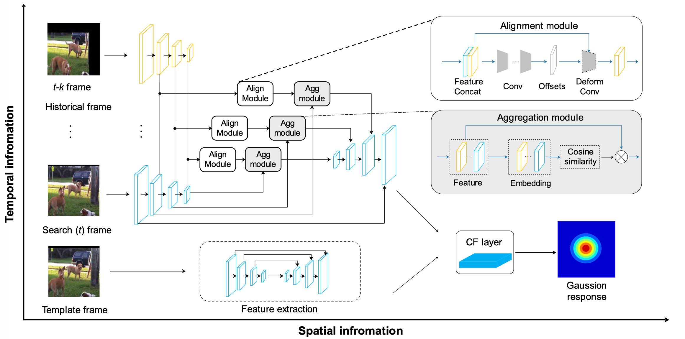
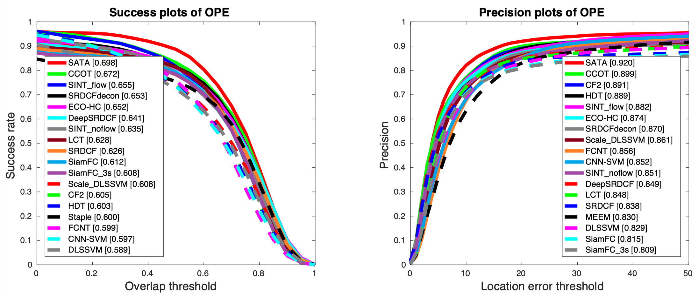

# Real Time Visual Tracking using Spatial-Aware Temporal Aggregation Network

By [Tao Hu](https://ecart18.github.io/), [Lichao Huang](https://scholar.google.com/citations?user=F2e_jZMAAAAJ&hl=en), [Han Shen](han.shen@horizon.ai).

The code for the official implementation of paper **[SATA](https://arxiv.org/abs/1908.00692)**. 

The code will be made publicly available after review.

## Contents
1. [Motivation](#motivation)
2. [Performances](#performance)
3. [Environment Setup](#environment-setup)
4. [Training & Inference](#train-inference)
5. [Acknowledgement](#acknowledgement)
6. [Bibtex](#bibtex)

## Motivation <a name="motivation">
<div align='center'><br></div>

## Performances <a name="performance">
#### Results

**SATA** obtains a significant improvements by feature aggregation

The OPE/TRE/SRE results on OTB [GoogleDrive](https://drive.google.com).

**OTB2013:** 
<div align='center'><br></div>

**OTB2015:** 
<div align='center'><br></div>


**Note:** 
- The results are better than reported in the paper because we modify some hyper-parameters.
- The results could be slightly different depending on the running environment.


## Environment Setup <a name="environment-setup">

**Env Requirements:** 
- Linux.
- Python 3.5+.
- PyTorch 1.3 or higher.
- CUDA 9.0 or higher.
- NCCL 2 or higher if you want to use distributed training.


0. Download ILSVRC2015 VID dataset from [ImageNet](http://bvisionweb1.cs.unc.edu/ilsvrc2015/download-videos-3j16.php#vid), extract files and put it in the directory you defined. 

1. After the download, link your datasets to the current directory, like,
    ```
    cd data
    ln -s  your/path/to/data/ILSVRC2015 ./ILSVRC2015
    ```
2. Split training and validation set. For example, I use MOT17-09 as validation set, and others video as training set. 
   ```
   ./ILSVRC2015
   ├── Annotations
   │   └── VID├── a -> ./ILSVRC2015_VID_train_0000
   │          ├── b -> ./ILSVRC2015_VID_train_0001
   │          ├── c -> ./ILSVRC2015_VID_train_0002
   │          ├── d -> ./ILSVRC2015_VID_train_0003
   │          ├── e -> ./val
   │          ├── ILSVRC2015_VID_train_0000
   │          ├── ILSVRC2015_VID_train_0001
   │          ├── ILSVRC2015_VID_train_0002
   │          ├── ILSVRC2015_VID_train_0003
   │          └── val
   ├── Data
   │   └── VID...........same as Annotations
   └── ImageSets
       └── VID
   ```

3. Download pre-train model for backbone, and put it in `./pretrainmodel`
    ```
    cd ./pretrainmodel
    wget  https://download.pytorch.org/models/resnet50-19c8e357.pth
    ```
4. Install others dependencies. Our environment is [PyTorch 1.3.0+cu92](https://pytorch.org/get-started/previous-versions/), [torchvision 0.4.1+cu92](https://pytorch.org/get-started/previous-versions/).
    ```
    pip install -r requirements.txt
    ```

## Training & Inference <a name="train-inference">

#### train model:
```
#  Multi GPUs (e.g. 4 GPUs)
cd ./experiments/train_tsr
CUDA_VISIBLE_DEVICES=0,1,2,3 python ../../scripts/train.py --cfg config.yaml
```

#### inference for online version:
```
cd ./experiments/test_tsr
python ../../scripts/test.py --cfg config.yaml
```

## Acknowledgement<a name="acknowledgement">

The work was mainly done during an internship at [Horizon Robotics](http://horizon.ai/).

## Bibtex<a name="bibtex">
Please consider citing our paper in your publications if the project helps your research. BibTeX reference is as follows.

```
@article{hu2019real,
  title={Real Time Visual Tracking using Spatial-Aware Temporal Aggregation Network},
  author={Hu, Tao and Huang, Lichao and Liu, Xianming and Shen, Han},
  journal={arXiv preprint arXiv:1908.00692},
  year={2019}
}
```

## License
For academic use, this project is licensed under the 2-clause BSD License - see the LICENSE file for details. For commercial use, please contact the authors. 